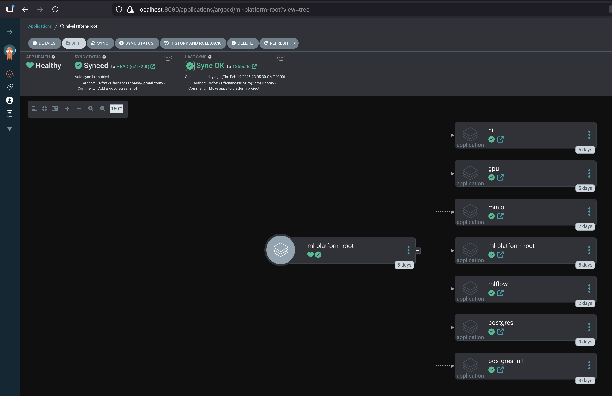
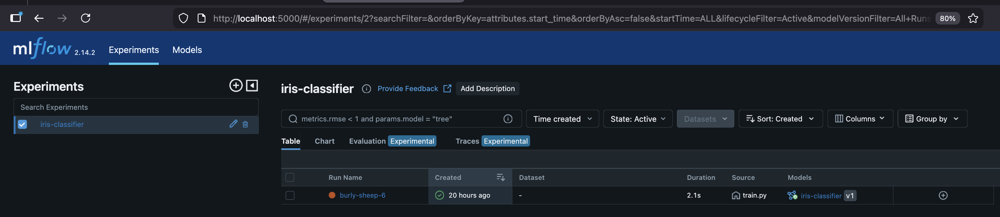
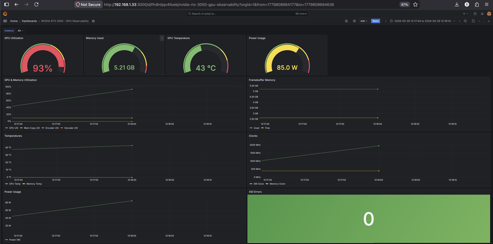
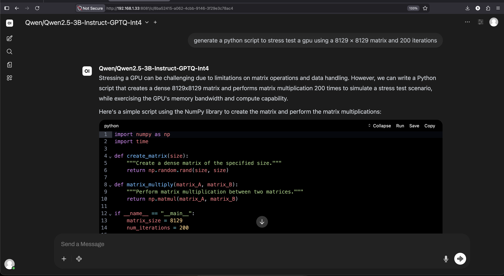

# GPU-Accelerated Machine Learning Platform

Machine Learning platform built on a self-managed Kubernetes cluster with NVIDIA GPU acceleration.

---

## Hardware Architecture

### Control Plane Node
- Intel i5-6300U @ 2.40GHz (2 cores, 4 threads)
- 8 GB RAM
- Ubuntu Server 22.04 LTS

### GPU Worker Node
- Intel i3-10105F @ 3.70GHz (4 cores, 8 threads)
- 24 GB RAM
- NVIDIA GeForce RTX 3050 (8 GB VRAM)
- Ubuntu Server 22.04 LTS

---

## Core Platform 

- Ubuntu Server 22.04 LTS  
- kubeadm (cluster bootstrap)  
- containerd (CRI runtime)  
- Cilium (eBPF-based CNI networking)  

---

## GPU Enablement

- NVIDIA GPU Operator  
- NVIDIA Device Plugin  
- GPU resource requests configured using `nvidia.com/gpu`

---

## MLOps Stack

- MLflow - Experiment tracking and model registry  
- MinIO - S3-compatible artifact storage  
- PostgreSQL - MLflow backend metadata store  

## Inference
- vLLM - OpenAI-compatible inference server
- Open WebUI - chat interface connected to vLLM serving Qwen2.5-3B-Instruct-GPTQ-Int4

---

## GitOps 

- Argo CD - Declarative GitOps deployment  
- App-of-Apps architecture  

All platform components are deployed and managed declaratively from Git.

---

## Observability Stack

- Prometheus - Metrics collection  
- Grafana - Dashboards and visualization  

Monitored signals:
- GPU resource utilization and temperature (from DCGM-Exporter)
- Node resource utilization  
- Pod-level metrics  
- Cluster health  
- ML workload resource usage

---

Screenshots

### ArgoCD Apps Overview

### ArgoCD App of Apps Detailed View

### Completed MLflow Experiment and Registered Model

## Grafana GPU Dashboard while serving Qwen2.5-3B-Instruct-GPTQ-Int4

## Open WebUI connected to vLLM serving Qwen model

