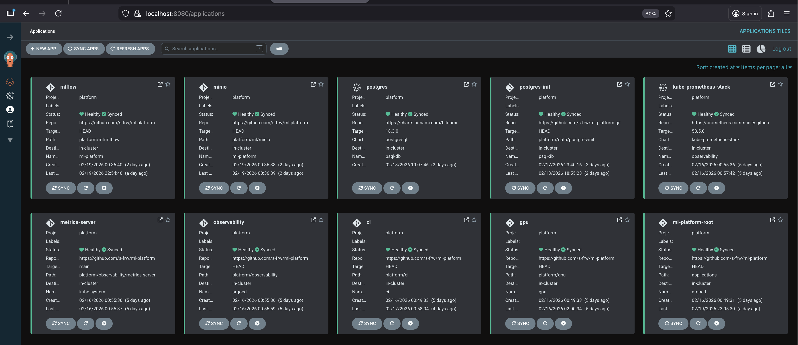

# GPU-Accelerated Machine Learning Platform

Machine Learning platform built on a self-managed Kubernetes cluster with NVIDIA GPU acceleration.

---

## Hardware Architecture

### Control Plane Node
- Intel i5-6300U @ 2.40GHz (2 cores, 4 threads)
- 8 GB RAM
- Ubuntu Server 22.04 LTS

### GPU Worker Node
- Intel i3-10105F @ 3.70GHz (4 cores, 8 threads)
- 24 GB RAM
- NVIDIA GeForce RTX 3050 (8 GB VRAM)
- Ubuntu Server 22.04 LTS

---

## Core Platform Stack

- Ubuntu Server 22.04 LTS  
- kubeadm (cluster bootstrap)  
- containerd (CRI runtime)  
- Cilium (eBPF-based CNI networking)  

Design goals:
- Production-like Kubernetes setup  
- Explicit control over networking and runtime  
- GPU-aware scheduling and resource isolation  

---

## GPU Enablement

- NVIDIA GPU Operator  
- NVIDIA Device Plugin  
- GPU resource requests configured using `nvidia.com/gpu`

---

## MLOps Stack

- Argo Workflows — ML training pipelines  
- MLflow — Experiment tracking and model registry  
- MinIO — S3-compatible artifact storage  
- PostgreSQL — MLflow backend metadata store  

Capabilities:
- Reproducible ML experiments  
- Artifact versioning  
- Pipeline-based model training  
- Persistent experiment metadata  

---

## GitOps and Continuous Delivery

- Argo CD — Declarative GitOps deployment  
- App-of-Apps architecture  
- Drift detection and reconciliation  
- Project-level isolation  

All platform components are deployed and managed declaratively from Git.

---

## Observability Stack

- Prometheus — Metrics collection  
- Grafana — Dashboards and visualization  

Monitored signals:
- Node resource utilization  
- Pod-level metrics  
- Cluster health  
- ML workload resource usage

---

## Screenshots

ArgoCD apps view

MLflow

Grafana Dashboard

